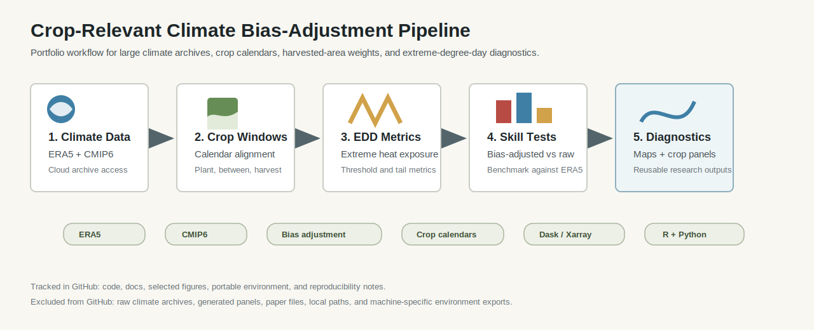
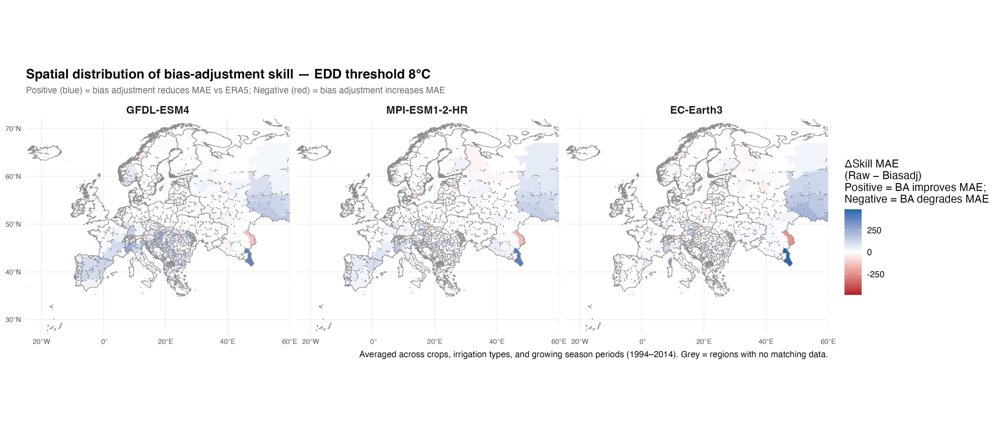
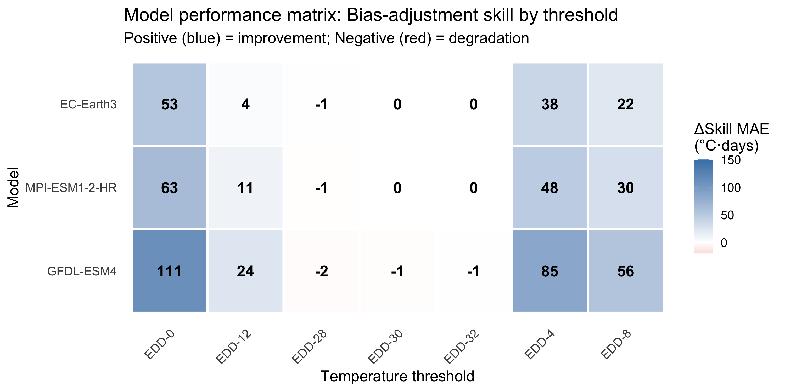
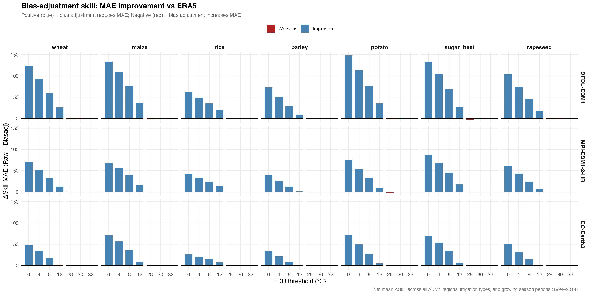

# Crop Yield Climate Bias Adjustment

Large-scale climate-data workflow for evaluating raw CMIP6, bias-adjusted CMIP6, and ERA5 reanalysis in crop-relevant extreme heat exposure measurement.

This repository is a public portfolio release of a research pipeline that computes extreme degree days (EDD) during crop growing seasons, links gridded climate archives to crop calendars and harvested-area weights, and evaluates whether bias-adjusted climate products improve crop exposure measurement.

## What This Demonstrates

This project is meant to show research-computing ability in agricultural climate-risk analysis:

- ERA5 reanalysis and CMIP6/GCM archive processing;
- Microsoft Planetary Computer, ESGF, and Pangeo-style data access;
- crop-calendar-specific extreme heat exposure construction;
- harvested-area and administrative-region aggregation;
- comparison of raw and bias-adjusted climate products against ERA5;
- R/Python workflow design for diagnostics, maps, tables, and reproducible research.

## Workflow



| Stage | Data product | Main scripts |
|---|---|---|
| 1. Climate access | ERA5, raw CMIP6, and bias-adjusted CMIP6 EDD inputs | `python_scripts/era5_*.py`, `python_scripts/esgf_*.py`, `python_scripts/pc_*.py` |
| 2. Crop exposure construction | Crop-calendar EDD panels by region, crop, irrigation, and period | `01_load_harmonize.R`, `python_scripts/*_edds_calendar.py` |
| 3. Bias-adjustment evaluation | MAE, RMSE, quantile, tail, KS, and correlation diagnostics | `02_metrics.R` |
| 4. Spatial and crop diagnostics | Maps, crop-threshold figures, and performance matrices | `03_maps.R`, `04_plots.R` |
| 5. Public outputs | Selected tables and communication figures | `05_generate_paper_tables.R`, `06_generate_conference_figures.R` |

## Selected Visuals

The public release includes selected visuals that demonstrate spatial diagnostics, crop-threshold evaluation, and workflow structure without releasing raw climate archives or full manuscript outputs.







See `docs/VISUAL_GALLERY.md` for figure notes.

## Example Data Products

The repository includes small real-data extracts in `examples/`. These are limited documentation samples, not a full replication dataset or full paper package.

| Example file | Purpose |
|---|---|
| `examples/sample_dskill_summary.csv` | Model-threshold summary of bias-adjustment skill |
| `examples/sample_crop_threshold_dskill.csv` | Crop-specific skill differences by EDD threshold |
| `examples/sample_raw_model_mae.csv` | Raw CMIP6 model error summary against ERA5 |
| `examples/sample_public_paper_summary.csv` | Compact public-paper summary table for selected model-threshold results |

See `docs/SAMPLE_TABLES.md` for a readable version.

## Repository Structure

```text
00_config.R                         Shared paths and analysis settings
01_load_harmonize.R                 Load and harmonize model/reanalysis panels
02_metrics.R                        Bias-adjustment skill and error metrics
03_maps.R                           Spatial diagnostics
04_plots.R                          Performance and distributional plots
05_generate_paper_tables.R          Summary table generation
06_generate_conference_figures.R    Selected figure generation
run_all.R                           Master workflow
python_scripts/
  era5_*.py                         ERA5 extreme-degree-day processing
  esgf_*.py                         Raw CMIP6 access and EDD construction
  pc_*.py                           Bias-adjusted CMIP6 access and EDD construction
docs/
  DATA_SOURCES.md                   Data provenance and access notes
  METHOD_OVERVIEW.md                High-level data and evaluation design
  REPRODUCIBILITY.md                Environment and run-order notes
  SAMPLE_TABLES.md                  Selected real-data sample tables
  VISUAL_GALLERY.md                 Notes on selected public visuals
  PUBLIC_RELEASE_CHECKLIST.md       Safe-public-release checklist
examples/
  Small real-data extracts from processed summary outputs
figures/selected/
  Selected public-facing diagnostics and workflow visual
```

## Reproducibility

```bash
conda env create -f environment.yml
conda activate crop-yield-climate-bias
```

The public repository is not a turnkey replication package because raw NetCDF/Zarr archives, shapefiles, and generated panels are large and provider-specific. See `docs/REPRODUCIBILITY.md` for the suggested run order and `docs/DATA_SOURCES.md` for access notes.

## Public-Release Scope

Included:

- curated R and Python source scripts;
- project documentation;
- selected public-facing visuals;
- small real-data table extracts;
- selected public-paper outputs;
- portable environment specification.

Excluded:

- raw ERA5, CMIP6, and bias-adjusted climate archives;
- local credentials, API tokens, and machine paths;
- generated NetCDF/Zarr/Parquet panels;
- manuscript files, submission materials, and full result tables.
